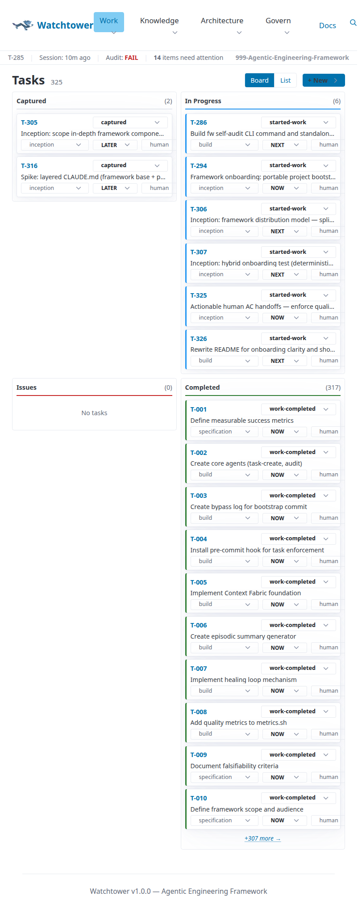
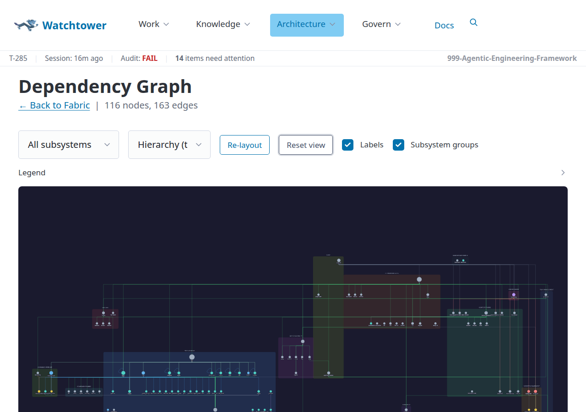

# Agentic Engineering Framework

> Governance and guardrails for AI coding agents in your repo. Not another chatbot.

This is not an assistant runtime, not an orchestration engine, and not a skills marketplace. It is a governance layer that sits inside your git repo and enforces structural rules on whatever AI coding agent you already use — Claude Code, Cursor, Copilot, or anything with CLI access. The agent cannot edit files without a task. It cannot force-push without human approval. It cannot lose context between sessions.

I built this because I recognised a pattern. In 25 years of enterprise IT governance — transition management at Shell, operational readiness for infrastructure programmes — the same structural requirements appear every time a powerful actor operates in a shared environment: traceability, approval gates, session continuity, failure memory. The domain changed from human operators to AI agents. The principle did not.

## What This Has Actually Stopped

Real output from this framework governing its own development (445 tasks, 312 completed):

**Agent tries to edit a file without a task:**
```
BLOCKED: No active task. Framework rule: nothing gets done without a task.

To unblock:
  1. Create a task:  fw task create --name '...' --type build --start
  2. Set focus:      fw context focus T-XXX

Attempting to modify: src/api/routes.ts
Policy: P-002 (Structural Enforcement Over Agent Discipline)
```

**Agent tries to force-push:**
```
══════════════════════════════════════════════════════════
  TIER 0 BLOCK — Destructive Command Detected
══════════════════════════════════════════════════════════

  Risk: FORCE PUSH overwrites remote history — may destroy teammates' work
  Command: git push --force origin main

  To proceed (after the human approves):
    ./bin/fw tier0 approve
  Then retry the same command.
══════════════════════════════════════════════════════════
```

**Agent tries to disable its own guardrails:**
```
BLOCKED: Cannot modify .claude/settings.json — this controls enforcement hooks.

Modifying this file could disable task gates, Tier 0 checks, and budget enforcement.
Changes to hook configuration require human review.
```

**Context running out mid-session:**
```
══════════════════════════════════════════════════════════
  SESSION WRAPPING UP (~170000 tokens)
══════════════════════════════════════════════════════════

  ALLOWED: git commit, fw handover, reading files
  BLOCKED: Write/Edit to source files, Bash

  Action: Commit your work, then run 'fw handover'
══════════════════════════════════════════════════════════
```

Every blocked action is logged. Every approval is auditable. 49 Tier 0 approvals recorded in the bypass log so far — all human-authorized, all traceable.

## The Problem

Without governance, AI agents edit files with no record of why, lose all context when sessions end, make destructive decisions autonomously, and accumulate technical debt that nobody can trace. Most teams address this with prompt instructions and hope. Prompt instructions are suggestions. Structural gates are enforcement.

The difference: telling someone to wear a hard hat versus installing a door that does not open without one.

## See It Work (5 Minutes)

```bash
# 1. Install
curl -fsSL https://raw.githubusercontent.com/DimitriGeelen/agentic-engineering-framework/master/install.sh | bash

# 2. Initialize a project
mkdir my-project && cd my-project && git init
fw init --provider claude

# 3. Try to work without a task — blocked
# (Claude Code's task gate prevents file edits until a task exists)

# 4. Create a task and start working — now edits are allowed
fw work-on "Add authentication" --type build

# 5. Run an audit, open the dashboard
fw audit                 # 90+ governance checks
fw serve                 # http://localhost:3000 — task board, audit, metrics
```

Five commands. Your repo now has task-traced commits, enforcement gates, continuous audit, and a dashboard showing project state.


## How Enforcement Works

```
Agent tries to edit a file
    │
    ▼
┌─────────────────────┐
│  Task gate (Tier 1)  │──── No active task? → BLOCKED
└─────────────────────┘
    │ ✓ Task exists
    ▼
┌─────────────────────┐
│  Budget gate         │──── Context > 85%? → BLOCKED (auto-handover)
└─────────────────────┘
    │ ✓ Budget OK
    ▼
    Edit proceeds ✓        Every commit traces back to a task
```

### Enforcement Depth by Agent

Full structural enforcement requires an agent that supports pre-operation hooks. Today, that means Claude Code. Other agents get git hooks and CLI tools — still more governance than most teams have, but not the same as blocking before the action happens.

| Capability | Claude Code (battle-tested) | Other agents (designed, not yet tested) |
|------------|---------------------------|----------------------------------------|
| Task gate — blocks file edits without a task | Structural (PreToolUse hook) | Convention (agent follows rules) |
| Tier 0 — blocks destructive commands | Structural (PreToolUse hook) | Convention |
| Budget management — prevents context exhaustion | Structural (reads transcript) | Manual |
| Commit traceability — task ref in every commit | Git hook (agent-agnostic) | Git hook (agent-agnostic) |
| Audit — 90+ governance checks | CLI (agent-agnostic) | CLI (agent-agnostic) |
| Session handover — context survives restarts | CLI (agent-agnostic) | CLI (agent-agnostic) |

This framework has been developed entirely under its own governance using Claude Code — 445 tasks, 312 completed, 96% commit traceability. Cursor, Copilot, Aider, and other agents are supported by design (`fw init --provider cursor`, `fw init --provider generic`) but have not been validated in production. Contributions and testing from users of those tools are welcome.

## Quickstart

### Fresh Project
```bash
mkdir my-project && cd my-project && git init
fw init --provider claude    # or: cursor, generic

# Option A: Explore before building
fw inception start "Define architecture"
fw inception decide T-001 go

# Option B: Start building immediately
fw work-on "Set up project structure" --type build
```

### Existing Project
```bash
cd existing-project
fw init --provider claude

fw work-on "Fix login timeout bug" --type build
fw audit                     # See where you stand
```

### Dashboard
```bash
fw serve                     # http://localhost:3000
```

## What You Get

<details>
<summary><b>Task Management</b> — every change traces to a task with acceptance criteria, verification gates, and decisions</summary>

One command to start: `fw work-on "Fix the bug" --type build`. Tasks are Markdown with YAML frontmatter — rich artifacts with acceptance criteria, verification gates, and decision records. Kanban board tracks tasks across Captured, In Progress, Issues, and Completed.


</details>

<details>
<summary><b>Session Memory</b> — three layers of persistent context so no session starts from zero</summary>

- **Working memory** — current session state, focus, pending actions
- **Project memory** — patterns, decisions, learnings that persist across all sessions
- **Episodic memory** — condensed task histories, auto-generated on completion

Includes semantic search via `fw recall` — find past decisions and patterns by meaning, not just keywords.
</details>

<details>
<summary><b>Component Topology</b> — a structural map of your project: what depends on what, and what breaks if you change it</summary>

```bash
fw fabric deps agents/git/git.sh        # What depends on this file?
fw fabric blast-radius HEAD              # What does this commit affect downstream?
fw fabric drift                          # Find unregistered or orphaned components
```

Interactive dependency graph with subsystem filtering, component search, and impact analysis:


</details>

<details>
<summary><b>Healing Loop</b> — failures are diagnosed, patterns recorded, mitigations suggested for next time</summary>

```bash
fw healing diagnose T-015                # Classify failure and suggest recovery
fw healing resolve T-015 --mitigation "Added retry logic"  # Record as pattern
```

Error escalation: A (do not repeat) → B (improve technique) → C (improve tooling) → D (change ways of working). Failures become institutional knowledge.
</details>

<details>
<summary><b>Continuous Audit</b> — 90+ governance checks run every 30 minutes, on every push, and on demand</summary>

Checks cover task quality, git traceability, structural integrity, and control effectiveness. Cron, pre-push hook, or `fw audit` on demand.
</details>

<details>
<summary><b>Session Handover</b> — structured context documents bridge sessions automatically</summary>

Every session ends with a handover that captures work in progress, suggested next actions, and open questions. The next session picks up where the last one stopped.
</details>

## Key Commands

| Command | Purpose |
|---------|---------|
| `fw work-on "name"` | Create task + set focus + start work |
| `fw audit` | Run governance checks |
| `fw doctor` | Check framework health |
| `fw handover --commit` | End-of-session context handover |
| `fw fabric overview` | System topology and dependencies |
| `fw recall "query"` | Semantic search across project knowledge |
| `fw metrics` | Project metrics and effort prediction |
| `fw inception start "name"` | Structured exploration before building |
| `fw help` | All available commands |

## What This Is Not

This framework does not execute agents, connect to messaging platforms, or provide a skills marketplace. It governs agents that already exist.

Run OpenClaw for multi-app automation. Run LangGraph for agent orchestration. Run CrewAI for multi-agent pipelines. Run this inside the repos those agents touch, so nothing gets committed without traceability and nothing gets destroyed without approval.

## Team Usage

- **Shared enforcement**: `fw git install-hooks` installs commit validation per-repo
- **Dashboard**: deploy [Watchtower](web/) for team-wide visibility
- **CI/CD**: gate PRs on governance compliance:

```yaml
# .github/workflows/audit.yml
- uses: DimitriGeelen/agentic-engineering-framework@v1
  with:
    fail-on-warnings: 'false'
```

## When to Use / When Not to Use

**Use this when:**
- AI agents work on your codebase regularly
- You need audit trails for agent actions
- Sessions span days and context is lost between them
- You want to prevent accidental destructive actions

**Skip this when:**
- Quick one-off prototypes
- Solo projects under a week
- You do not use AI coding agents

<details>
<summary><b>Architecture</b></summary>

The framework runs as a CLI (`fw`) that routes to specialized agents. Internally it is organized into 12 subsystems, but you interact with roughly 6 commands and a dashboard.

```
bin/fw                    CLI entry point
agents/
  context/                Memory, focus, budget gates
  git/                    Task-traced git operations + hooks
  handover/               Session handover generation
  healing/                Error recovery and pattern recording
  task-create/            Task creation + update + verification
  audit/                  Governance checks (90+ rules)
  fabric/                 Component topology — deps, impact, drift
  resume/                 Session recovery after compaction
lib/                      fw subcommands (init, inception, promote)
web/                      Watchtower dashboard (Flask + htmx)
.tasks/                   Task files (Markdown + YAML frontmatter)
.context/                 Working, project, and episodic memory
.fabric/                  Component topology cards
```
</details>

<details>
<summary><b>Principles</b></summary>

Four constitutional directives, in priority order:

1. **Antifragility** — the system strengthens under stress; failures are learning events
2. **Reliability** — predictable, observable, auditable execution; no silent failures
3. **Usability** — sensible defaults, actionable errors, minimal ceremony for common operations
4. **Portability** — no provider, language, or environment lock-in

Authority model:
```
Human     → SOVEREIGNTY  → Can override anything, is accountable
Framework → AUTHORITY    → Enforces rules, checks gates, logs everything
Agent     → INITIATIVE   → Can propose, request, suggest — never decides
```
</details>

## Self-Governing

This framework develops itself using its own governance. 445 tasks created, 312 completed, 96% commit traceability, every decision recorded and searchable. The framework is its own case study — or its own most elaborate yak-shave, depending on your perspective.

## Documentation

- **[FRAMEWORK.md](FRAMEWORK.md)** — Full operating guide (provider-neutral)
- **[CLAUDE.md](CLAUDE.md)** — Claude Code integration and complete reference
- **[Watchtower](web/)** — Web dashboard for tasks, audit, and discovery

## License

Apache 2.0 — see [LICENSE](LICENSE).

Copyright 2025-2026 Geelen & Company
