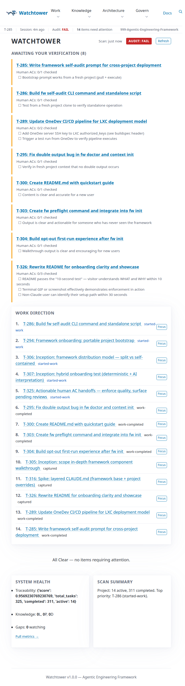
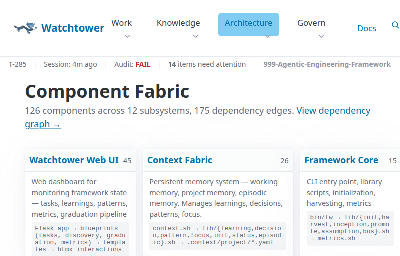
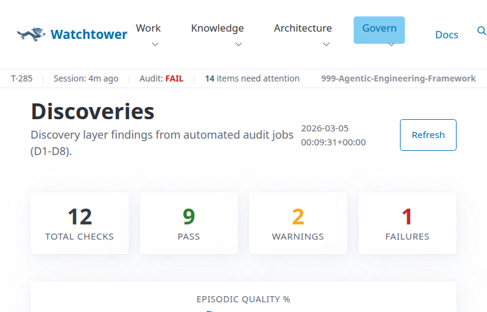
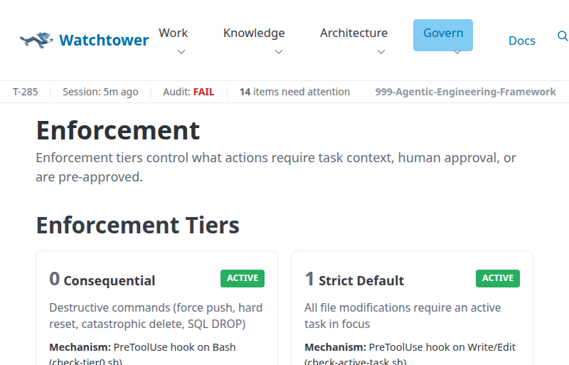
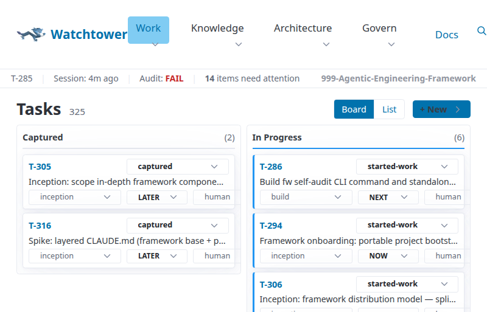

# Agentic Engineering Framework

> Guardrails for AI agents in your codebase.

Stop your AI agents from going rogue. The Agentic Engineering Framework enforces task traceability, structural gates, and session continuity so Claude Code, Cursor, Copilot, or any CLI agent works predictably inside your project — not just when it feels like it.

## The Problem

Without governance, AI agents:
- Edit files with no record of **why** — no task, no traceability, no audit trail
- Lose all context when sessions end — the next session starts from zero
- Make destructive decisions autonomously — force pushes, deleted files, no human approval
- Accumulate technical debt invisibly — no patterns learned, no failures recorded

## The Solution

This framework enforces what most teams only suggest:

- **Task-first enforcement** — File edits are blocked until an active task exists. Not guidelines — structural gates via hooks
- **Session continuity** — Handovers preserve context across agent restarts and compactions. No session starts from zero
- **Self-healing loop** — Failures are diagnosed, patterns recorded, and mitigations suggested automatically
- **Three-layer memory** — Working memory (session), project memory (patterns + decisions), episodic memory (task histories)
- **Tiered approval** — Destructive commands (force push, `rm -rf`, DROP TABLE) require explicit human sign-off
- **Continuous audit** — 90+ compliance checks run every 30 minutes, on every push, and on demand

## How Enforcement Works

```
Agent tries to edit a file
    │
    ▼
┌─────────────────────┐
│  Task gate (Tier 1)  │──── No active task? → BLOCKED
└─────────────────────┘
    │ ✓ Task exists
    ▼
┌─────────────────────┐
│  Budget gate         │──── Context > 75%? → BLOCKED (auto-handover)
└─────────────────────┘
    │ ✓ Budget OK
    ▼
    Edit proceeds ✓        Every commit traces back to a task
```

This isn't honor-system governance. The framework blocks the action mechanically before it happens.

## Quickstart

```bash
# Install
curl -fsSL https://raw.githubusercontent.com/DimitriGeelen/agentic-engineering-framework/main/install.sh | bash

# Initialize in your project
cd your-project && fw init

# Start your first task (creates task + sets focus + starts work)
fw work-on "Set up project structure" --type build

# When done
fw handover --commit
```

**What `fw init` creates:** `.context/` (memory system), `.tasks/` (task files), git hooks (commit validation), and a provider config file (CLAUDE.md, .cursorrules, or FRAMEWORK.md depending on your agent).

## What's Inside

The framework is organized into 12 subsystems — 126 components working together:

### Task Management
Create, track, and enforce tasks with acceptance criteria and verification gates. One command to start: `fw work-on "Fix the bug" --type build`.

### Watchtower Web Dashboard
Live project command center with task board, audit results, discovery scanner, and metrics. Surfaces items needing attention and prioritizes work direction.



### Context Fabric (Memory System)
Three-layer persistent memory:
- **Working memory** — Current session state, focus, pending actions
- **Project memory** — Patterns, decisions, learnings that persist across all sessions
- **Episodic memory** — Condensed task histories, auto-generated on completion

Includes semantic search via `fw recall` — find patterns by meaning, not just keywords.

### Component Fabric (Structural Topology)
Maps every significant file, its dependencies, and what depends on it. Know the blast radius before you commit.

```bash
fw fabric deps agents/git/git.sh    # What depends on this?
fw fabric blast-radius HEAD          # What will this commit affect?
fw fabric drift                      # Detect unregistered/orphaned files
```



### Git Traceability
Every commit must reference a task. Pre-push hooks validate traceability. Bypass exceptions are logged, never silent.

```bash
fw git commit -m "T-042: Fix login validation"
fw git log --traceability            # Task-filtered history
```

### Healing Loop
When tasks encounter issues, the framework diagnoses failure type, searches for similar patterns, and suggests recovery:

```bash
fw healing diagnose T-015            # Classify and suggest
fw healing resolve T-015 --mitigation "Added retry logic"  # Record fix as pattern
```

Error Escalation Ladder: **A** (don't repeat) → **B** (improve technique) → **C** (improve tooling) → **D** (change ways of working). Your failures become institutional knowledge.

### Audit System
90+ compliance checks across structure, task quality, git traceability, and controls:
- **Cron**: runs every 30 minutes automatically
- **Pre-push**: validates before code reaches remotes
- **On-demand**: `fw audit` anytime



### Enforcement Tiers

| Tier | What | Bypass |
|------|------|--------|
| **0** | Destructive commands (force push, hard reset, rm -rf) | Human approval via `fw tier0 approve` |
| **1** | All file modifications | Create a task first |
| **2** | Situational exceptions | Single-use, mandatory logging |
| **3** | Read-only operations (status, health checks) | Pre-approved |



### Context Budget Management
Monitors actual token usage from the session transcript. Blocks operations at critical level to prevent context exhaustion. Auto-generates handover when budget runs low.

### Handover System
Session continuity via structured handover documents. Never lose context — the framework bridges sessions automatically with suggested first actions and work-in-progress state.

### Learnings Pipeline
Knowledge graduates from individual task findings to project-wide practices:

```bash
fw promote suggest                   # Find graduation candidates
fw promote L-042 --name "Always validate inputs" --directive D1
```

### Inception Phase
Structured exploration before committing to build. Research artifacts, go/no-go decisions, and automatic follow-up task creation:

```bash
fw inception start "Evaluate caching strategy"
fw inception decide T-099 go         # Records decision, creates build tasks
```

## Key Commands

| Command | Purpose |
|---------|---------|
| `fw work-on "name"` | Create task + set focus + start work |
| `fw audit` | Run compliance checks |
| `fw doctor` | Check framework health |
| `fw handover --commit` | End-of-session handover |
| `fw fabric overview` | See system topology |
| `fw recall "query"` | Semantic search across project knowledge |
| `fw metrics` | Project metrics and effort prediction |
| `fw help` | Show all commands |

## Agent Setup

The framework works with **any** CLI-capable AI agent. Enforcement depth varies by provider:

### Claude Code (Full Enforcement)
```bash
fw init --provider claude    # Default
```
Auto-loads CLAUDE.md. Full structural enforcement via PreToolUse/PostToolUse hooks: task gate, Tier 0 guard, budget management, auto-handover. All 12 subsystems active.

### Cursor
```bash
fw init --provider cursor
```
Generates `.cursorrules` with core governance rules. CLI commands (`fw work-on`, `fw audit`, `fw handover`) work fully. Git hooks enforce commit traceability. Write/Edit gates require manual discipline — Cursor doesn't support pre-operation hooks.

### Other Agents (Copilot, Aider, Devin, etc.)
```bash
fw init --provider generic
```
Follow [FRAMEWORK.md](FRAMEWORK.md) as the operating guide. Full CLI and git hook support. Structural enforcement is voluntary — the agent must follow the rules by convention.

## Team Usage

- **Shared enforcement**: Git hooks install per-repo via `fw git install-hooks`. Every team member gets commit validation automatically
- **Dashboard**: Deploy [Watchtower](web/) for team-wide visibility into tasks, audit results, and compliance
- **CI/CD**: Run `fw audit` in your pipeline to gate PRs on compliance



## When to Use / When Not to Use

**Use this when:**
- AI agents work on your codebase regularly (daily/weekly)
- You need audit trails for agent actions
- Sessions span multiple days and context is lost between them
- You want to prevent accidental destructive actions
- Team members use different AI tools and you want consistent governance

**Skip this when:**
- Quick one-off prototypes or scripts
- Solo projects under a week
- You don't use AI coding agents

## Core Principles

<details>
<summary>Four Constitutional Directives</summary>

1. **Antifragility** — System strengthens under stress; failures are learning events
2. **Reliability** — Predictable, observable, auditable execution
3. **Usability** — Joy to use and extend; sensible defaults; actionable errors
4. **Portability** — No provider/language/environment lock-in

**Authority Model:**
```
Human     → SOVEREIGNTY  → Can override anything
Framework → AUTHORITY    → Enforces rules, checks gates
Agent     → INITIATIVE   → Can propose, never decides
```
</details>

<details>
<summary>Architecture</summary>

```
bin/fw                    CLI entry point (routes to agents)
agents/
  context/                Context Fabric — memory, focus, budget gates
  git/                    Task-traced git operations + hooks
  handover/               Session handover generation
  healing/                Antifragile error recovery
  task-create/            Task creation + update + verification
  audit/                  Compliance checking (90+ checks)
  fabric/                 Component topology — deps, impact, drift
  resume/                 Session recovery after compaction
lib/                      fw subcommands (init, inception, promote, bus)
web/                      Watchtower dashboard (Flask + htmx)
.tasks/                   Task files (active + completed)
.context/                 Working memory, project memory, episodic memory
.fabric/                  Component topology map (126 components)
```
</details>

## Documentation

- **[FRAMEWORK.md](FRAMEWORK.md)** — Full operating guide, provider-neutral. Includes glossary
- **[CLAUDE.md](CLAUDE.md)** — Claude Code integration + complete reference
- **[Watchtower](web/)** — Web dashboard for task/audit/discovery monitoring

## Self-Governing

This framework develops itself using its own governance. 325 tasks completed, 96% commit traceability, every decision recorded. The framework is its own proof of concept.

## License

Proprietary. All rights reserved.
